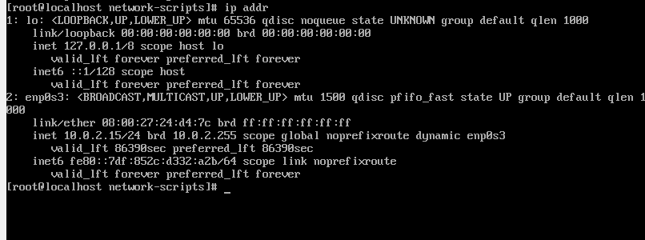

# 1.echo $PATH

显示当前PATH环境变量，该变量的值由一系列以冒号分隔的目录名组成。如：/usr/local/bin:/bin:/usr/bin。当我们执行程序时，shell自动跟据PATH变量的值去搜索该程序

比如我们现在的工作目录是根目录/ ，有一个程序sunrise在/bin/目录下，我们可以在命令行输入/bin/sunrise 这样来执行它，还可以直接输入sunrise，这时shell会自动去寻找sunrise这个程序所在的完整路径，找到之后才会去执行该程序。

**ex**：**PATH=$PATH:/**home/tito/bin #添加/home/tito/bin到PATH环境变量

## 2.ip addr看ip(centos7 Minimal )

root@localhost:~# ip addr
 1: **lo**: <LOOPBACK,UP,LOWER_UP> mtu 65536 qdisc noqueue state UNKNOWN group default qlen 1000
 	link/loopback 00:00:00:00:00:00 brd 00:00:00:00:00:00
 	inet 127.0.0.1/8 `scope host lo`
 	valid_lft forever preferred_lft forever
 	inet6 ::1/128 scope host
	 valid_lft forever preferred_lft forever
 2: **enp0s3**: `<BROADCAST,MULTICAST,UP,LOWER_UP> mtu 1500 qdisc pfifo_fast`  state UP group default qlen 1000
 	link/ether `fa:16:3e:c7:79:75` brd ff:ff:ff:ff:ff:ff

系统的网卡没有分配IP地址 网卡为enp0s3   en代表以太网卡

```shell
cd /etc/sysconfig/network-scripts
vi ifcfg-enp0s3   
```

将ONBOOT=no修改为ONBOOT=yes保存退出

重启网络服务

```shell
 service network restart
```

ip addr 查看是否分配到IP地址

​	


先更新

```shell
yum upgrade
```

找出哪个包提供了ifconfig命令

```shell
yum provides ifconfig
```

​	

“provides”或者“whatprovides”，用于找出某个包提供了某些功能或文件

安装net-tools包

```shell
yum install net-tools
```

输入ifconfig 发现ip为10.0.2.15 在Windows系统的cmd窗口ping一下，发现无法连接：

​	

出现这种情况，是因为VirtualBox的默认网络连接方式为：网络地址转换（NAT）---->将它更改桥接网卡

然后再输入【# ifconfig】命令，就可得到192这类ip地址了。

### 3.mkdir用来创建目录

​	**用法**：mkdir 【选项】【文件名】

​	使用帮助命令：man mkdir或mkdir -help

　　-m --mode=模式，设定权限<模式> (类似 chmod)，而不是 rwxrwxrwx 减 umask

　　-p --parents 递归创建目录

　　-v, --verbose 每次创建新目录都显示信息

　　　  --help 显示此帮助信息并退出

　　    --version 输出版本信息并退出

​	**实列一：创建一个空目录**

　　命令：mkdir abc

```shell
[root@CentOS-study data]# mkdir abc
[root@CentOS-study data]# ll
total 4
drwxr-xr-x 2 root root 4096 Nov 17 16:55 abc
-rw-r--r-- 1 root root    0 Nov 16 21:07 a.txt
-rw-r--r-- 1 root root    0 Oct 16 10:37 test.txt
```

​	**实列二：递归创建多个目录**

　　命令：mkdir -p test/test1

```shell
[root@CentOS-study data]# mkdir -p test/test1
[root@CentOS-study data]# tree 
.
├── abc
├── a.txt
├── test
│   └── test1
└── test.txt
```

**实列三：创建新目录都显示信息：**

　　命令：mkdir -v hao

```shell
[root@CentOS-study data]# mkdir -v hao
mkdir: created directory `hao'
[root@CentOS-study data]# ls
abc  a.txt  hao  test  test.txt
```

**实列四：创建权限为777的目录**

　　命令：mkdir -m 777 pc 

```shell
[root@CentOS-study data]# mkdir -m 777 pc
[root@CentOS-study data]# ll
total 16
drwxr-xr-x 2 root root 4096 Nov 17 16:55 abc
-rw-r--r-- 1 root root    0 Nov 16 21:07 a.txt
drwxr-xr-x 2 root root 4096 Nov 17 17:01 hao
drwxrwxrwx 2 root root 4096 Nov 17 17:06 pc
drwxr-xr-x 3 root root 4096 Nov 17 16:57 test
-rw-r--r-- 1 root root    0 Oct 16 10:37 test.txt
```

### 4.ll命令

**ll会列出该文件下的所有文件信息，包括隐藏的文件，而ls -l只列出显式文件，说明这两个命令还是不等同的**

ll不是命令，是ls -l的别名


### 5.tar -zxvf XXX.tar.gz

x : 从 tar 包中把文件提取出来
z : 表示 tar 包是被 gzip 压缩过的，所以解压时需要用 gunzip 解压
v : 显示详细信息
f xxx.[tar.gz](https://www.baidu.com/s?wd=tar.gz&tn=SE_PcZhidaonwhc_ngpagmjz&rsv_dl=gh_pc_zhidao) : 指定被处理的文件是 xxx.[tar.gz](https://www.baidu.com/s?wd=tar.gz&tn=SE_PcZhidaonwhc_ngpagmjz&rsv_dl=gh_pc_zhidao)

### 6.ps显示当前进程 (process) 的状态

```shell
ps [options] [--help]
```

	-e : 显示所有进程 
​	-f : 全格式 
​	-h : 不显示标题 
​	-l : 长格式 
​	-w : 宽输出 
​	a ：显示终端上的所有进程，包括其他用户的进程。 
​	r ：只显示正在运行的进程。 
​	u ：以用户为主的格式来显示程序状况。 

​	x ：显示所有程序，不以终端机来区分。

​	ps -ef|grep redis

​	 |符号，是个管道符号，表示ps 和 grep 命令同时执行；

​	grep 命令是查找（Global Regular Expression Print），能使用正则表达	式搜索文本，然后把匹配的行显示出来；
### 7.pwd命令用于显示工作目录

### 8.cat filename 观看某个文件的内容

### shell下命令输入错误的快速修改
    Ctrl-u    向左删除光标前所有字符
    
    Ctrl-k    向右删除光标后所有字符
    
    CTRL-w    向左删除光标前一个word
    
    CTRL-h    向左删除光标一个字符
    
    Ctrl-l    清除屏幕，只保持一行

